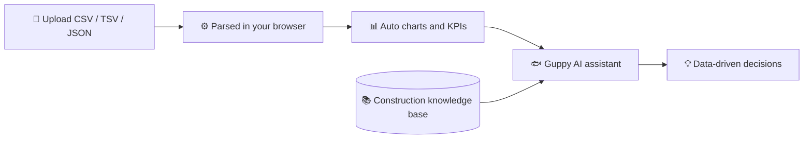

  

**[About](#-about-me) · [Flagship Project](#-flagship-project) · [Tech Stack](#-tech-stack) · [Experience](#-experience--certifications) · [Connect](#-lets-connect)**

---

## 👋 About Me

<table>
<tr>
<td width="62%" valign="top">

I'm a **B.Tech CSE (Data Science)** graduate from Hyderabad 🇮🇳 who turns messy data into clear decisions, and builds AI tools that people can actually use.

- 📊 **Data storyteller**: dashboards and analysis that lead to a decision
- 🤖 **GenAI builder**: RAG pipelines, chatbots, and local LLM setups
- 🎯 **Detail-oriented**: I validate outputs before I trust them
- ⚡ **Rapid prototyper**: I prototype fast with AI tools, then make it production-ready
- 🎬 **Creative side**: experimenting with AI filmmaking using Gemini Veo 3

**🔭 Currently building:** VISION Bai (RAG + Guppy AI)
**🌱 Exploring:** Ollama + Mistral 7B · AI agents & memory · vector databases
**📫 Open to:** Data Analyst roles · GenAI projects · collaborations

> *Data tells the story, AI helps write it ✨*

</td>
<td width="38%" align="center" valign="middle">

</td>
</tr>
</table>

---

## 🔮 Flagship Project

### VISION Bai: Construction Business RAG Bot

> Turn any spreadsheet into a dashboard, then ask questions about it in plain English.

<table>
<tr>
<td width="33%"> Drop a CSV, TSV or JSON file</td>
<td width="33%"> Automatic chart suggestions</td>
<td width="33%"> Guppy explains your data</td>
</tr>
</table>

**What I built**

- 🤖 A construction-focused **RAG chatbot** running locally on **Ollama + Mistral 7B**
- 📚 A **construction knowledge base**, so answers are domain-specific, not generic
- 📊 **Project data analysis**: automatic charts, KPIs, and business insights from uploaded files
- 🐟 **Guppy**, an in-app AI assistant that explains charts and reports and supports data-driven decisions
- 🔒 **Privacy-first**: files (up to 50,000 rows) are processed in the browser and never uploaded to a server

<!-- Add a live demo link here if you have one:

-->

### More work

| Project | What it is | Stack |
|---|---|---|
| [**MINI-PROJECT**](https://github.com/mr-pr0fessional/MINI-PROJECT) | Data project completed during my internship at YBI Foundation |  |
| 🚧 *Coming soon* | Dashboards, data analysis, and GenAI apps | |

---

## 🧰 Tech Stack

<table>
<tr><td><b>📊 Data & Analytics</b></td><td>

</td></tr>
<tr><td><b>🤖 GenAI & LLMs</b></td><td>

</td></tr>
<tr><td><b>💻 Frontend</b></td><td>

</td></tr>
<tr><td><b>🛠️ Dev Tools</b></td><td>

</td></tr>
</table>

---

## 💼 Experience & Certifications

<table>
<tr>
<td width="50%" valign="top">

### Experience
**Gen AI Data Analyst Intern**
*Nettms Urban Habitat*

<!-- Add 2-3 bullets with results, e.g. "Built X that reduced Y by Z%" -->

### Education
**B.Tech CSE (Data Science)**
*AVN Institute of Engineering & Technology* · 2022 to 2026

</td>
<td width="50%" valign="top">

### Certifications
- ✅ Data Analyst with GenAI, *Nettms Urban Habitat*
- ✅ AI Fundamentals, *IBM*
- ✅ TCS Young Professional, *TCS iON Digital*

</td>
</tr>
</table>

---

## 📈 GitHub Stats

---

## 🤝 Let's Connect

I'm open to **data analyst and GenAI roles**, freelance projects, and collaborations. If you're working on something with data or LLMs, let's talk!

